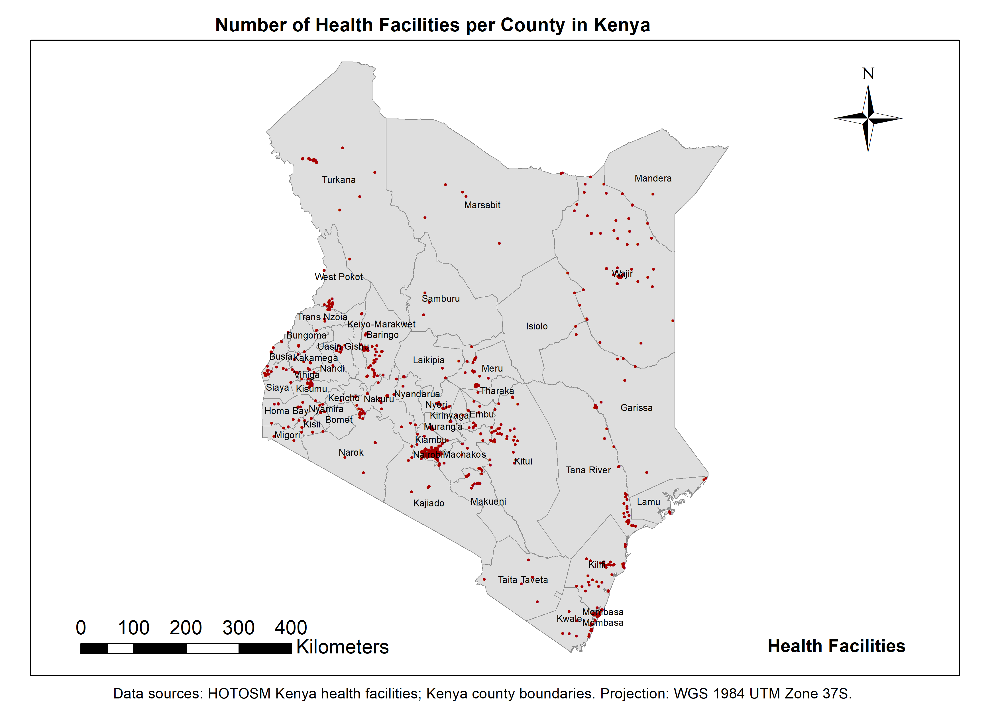

# Healthcare Accessibility Analysis in Kenya

This project analyzes healthcare accessibility across Kenya using GIS techniques.

## Methods

* Mapping health facility distribution
* 5 km buffer analysis
* Spatial join for facility count per county

## Tools Used

* ArcMap
* GIS spatial analysis techniques

## Output

Maps illustrating accessibility patterns and regional disparities in healthcare services.
## Maps

### 1. Health Facility Distribution in Kenya

### 2. 5 km Healthcare Accessibility Buffer

### 3. Facilities per County (Spatial Join Analysis)

